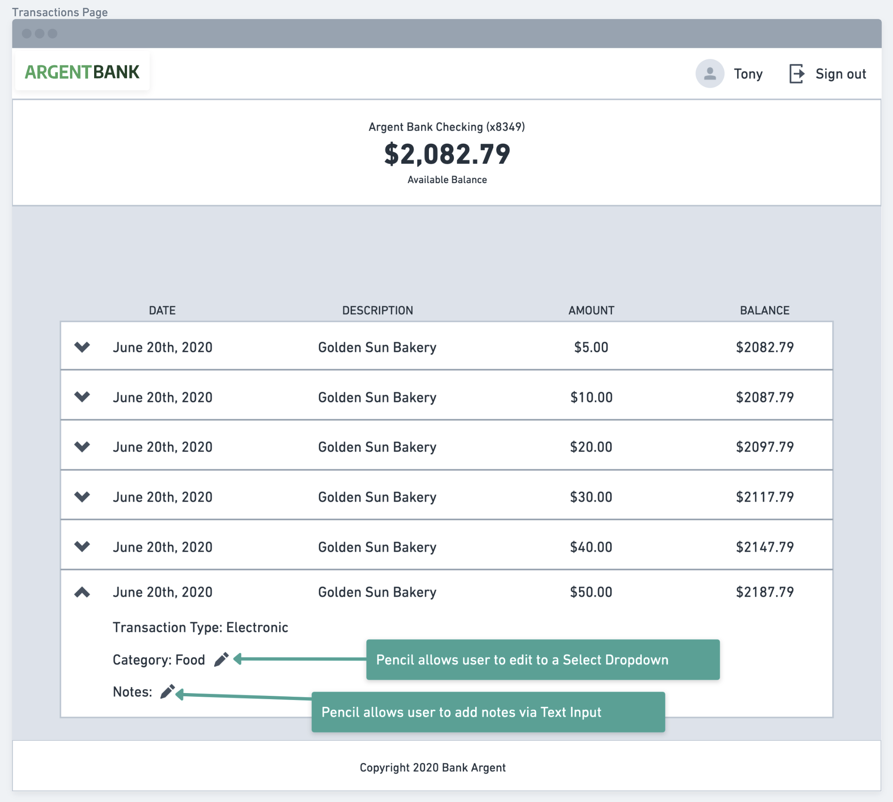
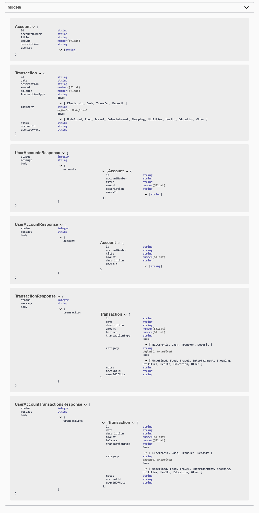

# Project #13 - Argent Bank API

This codebase contains the code needed to run the backend for Argent Bank.  
\+ Proposed Endpoints for Phase 2 of the API [HERE](#phase-2--transactions)


## Getting Started

### Prerequisites

Argent Bank uses the following tech stack:

- [Node.js v12](https://nodejs.org/en/) minimun
- [MongoDB Community Server](https://www.mongodb.com/try/download/community)
- [MongoDB Shell (mongosh)](https://www.mongodb.com/try/download/shell)

Please make sure you have the right versions and download three packages. You can verify this by using the following commands in your terminal:

```bash
# Check Node.js version
node --version

# Check Mongod version
mongod --version

# Check Mongosh version
mongosh --version
```

### Instructions

1. Fork this repo
1. Clone the repo onto your computer
1. Open a terminal window in the cloned project
1. Run the following commands:

```bash
# Install dependencies
npm install

# Start local dev server
npm run dev:server

# Populate database with two users (in over terminal window, when local dev server started)
npm run populate-db
```

Your server should now be running at http://locahost:3001 and you will now have two users in your MongoDB database!

## Populated Database Data

Once you run the `populate-db` script, you should have two users in your database:

### Tony Stark

- First Name: `Tony`
- Last Name: `Stark`
- Email: `tony@stark.com`
- Password: `password123`

### Steve Rogers

- First Name: `Steve`,
- Last Name: `Rogers`,
- Email: `steve@rogers.com`,
- Password: `password456`

## API Documentation

To learn more about how the API works, once you have started your local environment, you can visit: http://localhost:3001/api-docs

## Design Assets

Static HTML and CSS has been created for most of the site and is located in: `/designs`.

For some of the dynamic features, like toggling user editing, there is a mock-up for it in `/designs/wireframes/edit-user-name.png`.

And for the API model that you will be proposing for transactitons, the wireframe can be found in `/designs/wireframes/transactions.png`.

# Phase 2 : Transactions

We are still in the design phase.  
Since you are already managing the web application for Phase 1, we would like to hear your thoughts on how you think the APIs should be modeled on the back end. We need you to provide us with a document describing the proposed APIs for transactions, following Swagger guidelines.

## Mockup design
  

## Proposals  

1. Routes  

  

  

  

  

2. Models  

  

3. Link to the Swagger file  

   [swagger.yaml](swagger.yaml)

